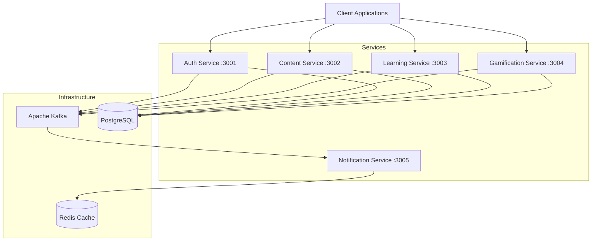
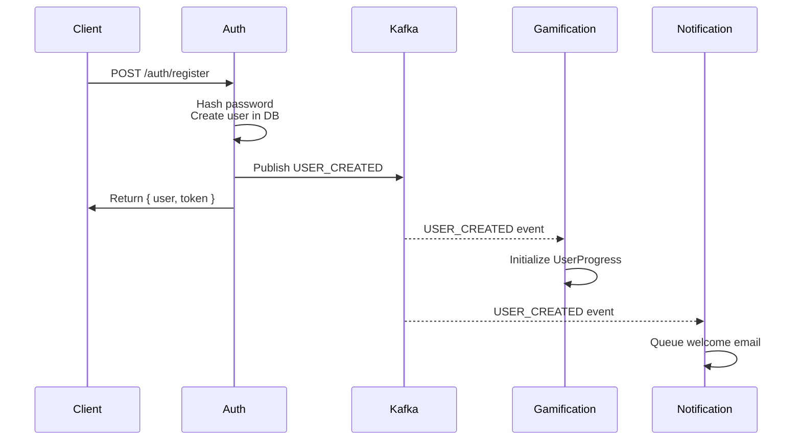
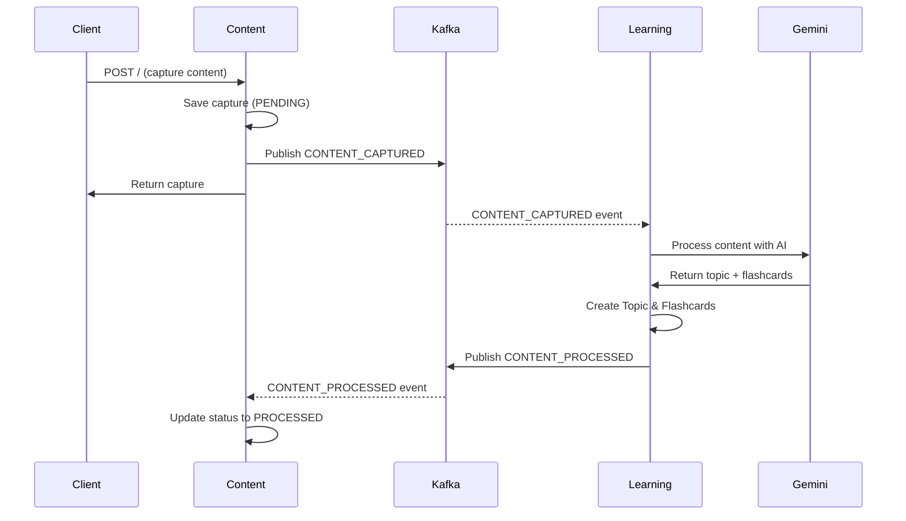
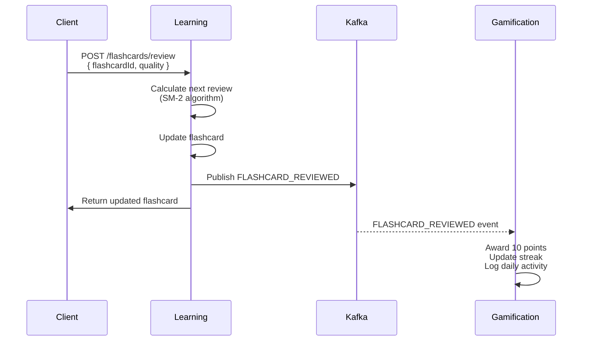
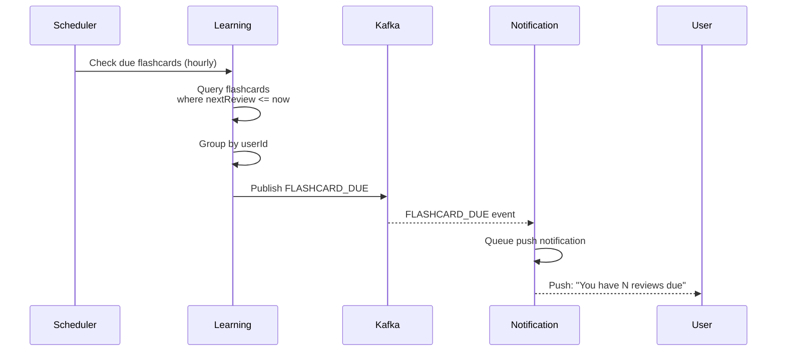

# Kai Backend - Microservices Architecture

> **Event-Driven Learning Platform Backend**  
> A scalable microservices architecture for AI-powered content capture, learning, and gamification.

## 📋 Table of Contents

- [Architecture Overview](#architecture-overview)
- [Infrastructure](#infrastructure)
- [Microservices](#microservices)
- [Data Flow](#data-flow)
- [Getting Started](#getting-started)
- [API Reference](#api-reference)
- [Database Schemas](#database-schemas)
- [Event System](#event-system)
- [Development](#development)
- [Remaining Work](#remaining-work)

---

## 🏗️ Architecture Overview

Kai follows an event-driven microservices architecture with the following key components:



### Design Principles

- **Event-Driven**: Asynchronous communication via Kafka for loose coupling
- **Database Per Service**: Each microservice owns its data (auth_db, content_db, learning_db, gamification_db)
- **Technology Stack**: Bun runtime, TypeScript, Express, Prisma ORM, PostgreSQL
- **Scalability**: Horizontal scaling with containerized services
- **Resilience**: Graceful error handling, Kafka retry mechanisms

---

## 🔧 Infrastructure

### Core Components

| Component | Version | Purpose | Port |
|-----------|---------|---------|------|
| **PostgreSQL** | 16-alpine | Primary database with 4 separate DBs | 5432 |
| **Apache Kafka** | 7.3.0 | Event streaming platform | 9092 |
| **Zookeeper** | 7.3.0 | Kafka coordination | 2181 |
| **Redis** | alpine | Caching & queue backend | 6379 |

### Database Configuration

PostgreSQL hosts 4 isolated databases:
- `auth_db` - User authentication data
- `content_db` - Content captures
- `learning_db` - Topics, flashcards, syllabi
- `gamification_db` - User progress, achievements, streaks

### Message Broker Topics

- `user-events` - User lifecycle events (registration, profile updates)
- `content-events` - Content capture and processing events
- `learning-events` - Learning activities (topic completion, flashcard reviews)
- `reminder-events` - Scheduled reminders and notifications

---

## 🎯 Microservices

### 1. Auth Service (Port 3001)

**Purpose**: User authentication and authorization

#### Database Schema (auth_db)

```prisma
model User {
  id                String   @id @default(uuid())
  email             String   @unique
  password          String   // bcrypt hashed
  name              String?
  role              String   @default("USER") // USER, ADMIN
  isVerified        Boolean  @default(false)
  verificationToken String?
  createdAt         DateTime @default(now())
  updatedAt         DateTime @updatedAt
}
```

#### API Endpoints

| Method | Endpoint | Description | Request Body | Response |
|--------|----------|-------------|--------------|----------|
| POST | `/auth/register` | Register new user | `{ email, password, name }` | `{ id, email, name, token }` |
| POST | `/auth/login` | User login | `{ email, password }` | `{ user: { id, email, name }, token }` |

#### Features Implemented

✅ User registration with bcrypt password hashing  
✅ JWT token-based authentication (1h expiry)  
✅ User login with credential validation  
✅ Kafka event publishing (USER_CREATED)  
✅ Duplicate email prevention  

#### Features Remaining

❌ Email verification flow  
❌ Password reset functionality  
❌ Refresh token mechanism  
❌ OAuth integration (Google, GitHub)  
❌ Role-based access control (RBAC)  
❌ Account lockout after failed attempts  
❌ User profile update endpoints  
❌ Admin user management  

#### Event Publishing

- **USER_CREATED**: Published when a new user registers
  ```typescript
  {
    type: 'USER_CREATED',
    data: {
      id: string,
      email: string,
      name: string,
      createdAt: Date
    }
  }
  ```

---

### 2. Content Service (Port 3002)

**Purpose**: Content capture and management (screenshots, text, videos)

#### Database Schema (content_db)

```prisma
model Capture {
  id        String   @id @default(uuid())
  userId    String
  type      String   // SCREENSHOT, TEXT, VIDEO
  content   String   // Text content or URL
  source    String?  // App name (e.g., "Twitter")
  status    String   @default("PENDING") // PENDING, PROCESSED, FAILED
  metadata  String?  // JSON string for extra info
  createdAt DateTime @default(now())
  updatedAt DateTime @updatedAt
}
```

#### API Endpoints

| Method | Endpoint | Description | Request Body | Response |
|--------|----------|-------------|--------------|----------|
| POST | `/` | Create content capture | `{ userId, type, content, source }` | `{ id, userId, type, content, source, status, createdAt }` |
| GET | `/` | Get user's captures | Query: `userId` | `[...captures]` |

#### Features Implemented

✅ Content capture creation (SCREENSHOT, TEXT, VIDEO)  
✅ Content retrieval by userId  
✅ Kafka event publishing (CONTENT_CAPTURED)  
✅ Status tracking (PENDING, PROCESSED, FAILED)  
✅ Consumer for CONTENT_PROCESSED events (updates status)  

#### Features Remaining

❌ File upload for screenshots/videos  
❌ Content search and filtering  
❌ Pagination for captures list  
❌ Content deletion  
❌ Content tagging system  
❌ OCR for screenshot text extraction  
❌ Video transcription  
❌ Content analytics  

#### Event System

**Publishing:**
- **CONTENT_CAPTURED**: When new content is captured

**Consuming:**
- **CONTENT_PROCESSED**: Updates capture status from Learning Service

---

### 3. Learning Service (Port 3003)

**Purpose**: AI-powered learning content generation with spaced repetition

#### Database Schema (learning_db)

```prisma
model Topic {
  id        String   @id @default(uuid())
  name      String
  userId    String
  parentId  String?  // For hierarchical topics
  createdAt DateTime @default(now())
  updatedAt DateTime @updatedAt
}

model Syllabus {
  id        String   @id @default(uuid())
  topicId   String
  content   String   // JSON structure of the syllabus
  createdAt DateTime @default(now())
  updatedAt DateTime @updatedAt
}

model Flashcard {
  id         String   @id @default(uuid())
  topicId    String
  front      String
  back       String
  nextReview DateTime
  interval   Int      // Days until next review
  easeFactor Float    // SM-2 algorithm ease factor
  difficulty String   @default("NORMAL") // EASY, NORMAL, HARD
  createdAt  DateTime @default(now())
  updatedAt  DateTime @updatedAt
}
```

#### API Endpoints

| Method | Endpoint | Description | Request Body | Response |
|--------|----------|-------------|--------------|----------|
| POST | `/topics` | Create topic | `{ name, userId }` | `{ id, name, userId, createdAt }` |
| POST | `/flashcards` | Create flashcard | `{ front, back, topicId }` | `{ id, front, back, topicId, nextReview, interval, easeFactor }` |
| POST | `/flashcards/review` | Review flashcard | `{ flashcardId, quality }` | `{ ...updatedFlashcard }` |
| POST | `/topics/complete` | Mark topic complete | `{ topicId, userId }` | `{ topicId, userId }` |

#### Features Implemented

✅ Topic creation and management  
✅ Flashcard CRUD operations  
✅ **Spaced Repetition System (SM-2 Algorithm)**  
  - Quality-based interval calculation (0-5 scale)  
  - Ease factor adjustment  
  - Next review date prediction  
✅ **AI Content Processing (Gemini LLM)**  
  - Automatic topic extraction from content  
  - AI-generated flashcards (3-5 per topic)  
  - Fallback to mock generation if API key missing  
✅ **Review Scheduler**  
  - Hourly check for due flashcards  
  - Aggregates due reviews by user  
  - Publishes FLASHCARD_DUE events  
✅ Kafka consumer for CONTENT_CAPTURED events  
✅ Event publishing (TOPIC_COMPLETED, FLASHCARD_REVIEWED, CONTENT_PROCESSED)  

#### Features Remaining

❌ Topic hierarchy/nested topics display  
❌ Syllabus generation and management  
❌ Bulk flashcard import  
❌ Flashcard statistics and analytics  
❌ Learning path recommendations  
❌ Custom study sessions  
❌ Flashcard search and filtering  
❌ Export flashcards (Anki format)  
❌ Image/audio support in flashcards  
❌ Multi-language support  

#### Services & Algorithms

**SpacedRepetition Service** (`/services/spaced-repetition.ts`)
- Implements **SM-2 (SuperMemo 2) algorithm**
- Quality ratings: 0 (blackout) to 5 (perfect recall)
- Intervals: 1 day → 6 days → interval * easeFactor
- Minimum ease factor: 1.3
- Failure (quality < 3): Reset to 1-day interval

**ContentProcessor Service** (`/services/content-processor.ts`)
- Uses Google Gemini Pro model
- Extracts main topic from text
- Generates 3-5 flashcards automatically
- JSON output parsing with markdown cleanup
- Mock generation fallback

**ReviewScheduler** (`/schedulers/review-scheduler.ts`)
- Runs every hour
- Queries flashcards with `nextReview <= now`
- Groups by userId
- Publishes reminder events

#### Event System

**Publishing:**
- **TOPIC_COMPLETED**: When user marks topic as complete
- **FLASHCARD_REVIEWED**: After flashcard review with quality rating
- **CONTENT_PROCESSED**: After generating topic/flashcards from captured content

**Consuming:**
- **CONTENT_CAPTURED**: Triggers AI processing to create topics and flashcards

---

### 4. Gamification Service (Port 3004)

**Purpose**: User progress tracking, streaks, achievements, and leaderboards

#### Database Schema (gamification_db)

```prisma
model UserProgress {
  id        String   @id @default(uuid())
  userId    String   @unique
  points    Int      @default(0)
  level     Int      @default(1)
  streak    Int      @default(0)
  createdAt DateTime @default(now())
  updatedAt DateTime @updatedAt
}

model DailyActivity {
  id        String   @id @default(uuid())
  userId    String
  date      DateTime @default(now()) // Normalized to start of day
  points    Int      @default(0)
  actions   Int      @default(0)
  createdAt DateTime @default(now())
  updatedAt DateTime @updatedAt

  @@unique([userId, date])
}

model Achievement {
  id          String   @id @default(uuid())
  name        String
  description String
  points      Int
  createdAt   DateTime @default(now())
}

model UserAchievement {
  id            String   @id @default(uuid())
  userId        String
  achievementId String
  unlockedAt    DateTime @default(now())
}
```

#### API Endpoints

| Method | Endpoint | Description | Response |
|--------|----------|-------------|----------|
| GET | `/leaderboard` | Get top 10 users by points | `[{ userId, points, level, streak }]` |
| GET | `/share/:userId` | Get social share data | `{ text, stats, platforms: { twitter, linkedin } }` |

#### Features Implemented

✅ User progress initialization on USER_CREATED  
✅ **Rules Engine** for points and streak calculation  
  - TOPIC_COMPLETED: 50 points, 1 action  
  - FLASHCARD_REVIEWED: 10 points, 1 action  
✅ Daily activity tracking (upsert by userId + date)  
✅ **Streak Management**  
  - Consecutive day detection  
  - Streak reset on gap > 1 day  
  - Only updates on first action of the day  
✅ Leaderboard (top 10 by points)  
✅ Social share text generation (Twitter, LinkedIn)  
✅ Kafka consumers (USER_CREATED, TOPIC_COMPLETED, FLASHCARD_REVIEWED)  

#### Features Remaining

❌ Level-up logic and thresholds  
❌ XP system separate from points  
❌ Achievement definitions and unlock logic  
❌ User achievement retrieval  
❌ Badges and trophies  
❌ Weekly/monthly leaderboards  
❌ Friend leaderboards  
❌ Streak freeze/protection items  
❌ Challenge system  
❌ Progress visualization  
❌ Gamification analytics  

#### Services

**RulesEngine** (`/services/rules-engine.ts`)
- Points allocation per event type
- Daily activity logging with upsert
- Streak calculation based on consecutive days
- Anti-duplicate streak updates (only on first action)

#### Event System

**Consuming:**
- **USER_CREATED**: Initializes UserProgress (0 points, level 1, 0 streak)
- **TOPIC_COMPLETED**: Awards 50 points, updates streak
- **FLASHCARD_REVIEWED**: Awards 10 points, updates streak

---

### 5. Notification Service (Port 3005)

**Purpose**: Email and push notification delivery using job queues

#### Technology

- **BullMQ**: Redis-backed job queues
- **Redis**: Queue storage and processing
- No Prisma/database (stateless)

#### Features Implemented

✅ **Email Worker** (BullMQ queue: `email-queue`)  
  - Welcome email on USER_CREATED  
  - Mock email sending (1s delay)  
✅ **Push Worker** (BullMQ queue: `push-queue`)  
  - Flashcard due reminders  
  - Streak warning notifications  
  - Mock push sending (500ms delay)  
✅ Kafka consumers:  
  - USER_CREATED → Welcome email  
  - FLASHCARD_DUE → Push notification  
  - STREAK_WARNING → Push notification  

#### Features Remaining

❌ Actual email integration (SendGrid, AWS SES)  
❌ Actual push notification integration (FCM, APNS)  
❌ Email templates system  
❌ Notification preferences per user  
❌ Unsubscribe functionality  
❌ Notification history/log  
❌ SMS notifications  
❌ In-app notifications  
❌ Notification scheduling  
❌ Rich push notifications with actions  

#### Workers

**Email Worker** (`/workers/email-worker.ts`)
- Job data: `{ to, subject, body }`
- Logs: job start, completion, failures

**Push Worker** (`/workers/push-worker.ts`)
- Job data: `{ userId, title, body }`
- Logs: job start, completion, failures

#### Event System

**Consuming:**
- **USER_CREATED**: Queues welcome email
- **FLASHCARD_DUE**: Queues push notification with due count
- **STREAK_WARNING**: Queues push notification with streak count

---

## 🔄 Data Flow

### User Registration Flow



### Content Capture → Learning Flow



### Flashcard Review → Gamification Flow



### Review Reminder Flow



---

## 🚀 Getting Started

### Prerequisites

- [Bun](https://bun.sh) >= 1.0
- [Docker](https://www.docker.com/) & Docker Compose
- [Node.js](https://nodejs.org/) >= 18 (optional, for compatibility)

### Environment Setup

1. **Clone the repository**
   ```bash
   git clone <repository-url>
   cd kai
   ```

2. **Copy environment template**
   ```bash
   cp .env.example .env
   ```

3. **Configure Gemini API Key** (for AI content processing)
   ```bash
   # Add to .env
   GEMINI_API_KEY=your-api-key-here
   ```

### Running with Docker Compose

```bash
# Start all services
docker-compose up -d

# View logs
docker-compose logs -f

# Stop all services
docker-compose down

# Stop and remove volumes (data reset)
docker-compose down -v
```

### Local Development

```bash
# Install dependencies
bun install

# Run all migrations
cd services/auth-service && bun run prisma migrate dev
cd services/content-service && bun run prisma migrate dev
cd services/learning-service && bun run prisma migrate dev
cd services/gamification-service && bun run prisma migrate dev

# Start services individually
cd services/auth-service && bun run index.ts
cd services/content-service && bun run index.ts
cd services/learning-service && bun run index.ts
cd services/gamification-service && bun run index.ts
cd services/notification-service && bun run src/index.ts

# Or use the start script
./start-dev.sh
```

### Health Checks

- Auth Service: http://localhost:3001
- Content Service: http://localhost:3002
- Learning Service: http://localhost:3003
- Gamification Service: http://localhost:3004
- Notification Service: http://localhost:3005
- PostgreSQL: localhost:5432
- Kafka: localhost:9092
- Redis: localhost:6379

---

## 📚 API Reference

> **Note**: All services currently lack authentication middleware. JWT tokens are generated but not validated on protected routes.

### Authentication

Include JWT token in headers for authenticated requests:
```bash
Authorization: Bearer <token>
```

### Example API Calls

#### Register User
```bash
curl -X POST http://localhost:3001/auth/register \
  -H "Content-Type: application/json" \
  -d '{"email":"user@example.com","password":"secret123","name":"John Doe"}'
```

#### Capture Content
```bash
curl -X POST http://localhost:3002/ \
  -H "Content-Type: application/json" \
  -d '{"userId":"user-uuid","type":"TEXT","content":"Learn Docker containers","source":"Notes"}'
```

#### Review Flashcard
```bash
curl -X POST http://localhost:3003/flashcards/review \
  -H "Content-Type: application/json" \
  -d '{"flashcardId":"flashcard-uuid","quality":4}'
```

#### Get Leaderboard
```bash
curl http://localhost:3004/leaderboard
```

---

## 🗄️ Database Schemas

### Migration Commands

```bash
# Generate Prisma client
bun run prisma generate

# Create migration
bun run prisma migrate dev --name migration-name

# Apply migrations
bun run prisma migrate deploy

# Reset database (⚠️ deletes all data)
bun run prisma migrate reset
```

### Schema Locations

- Auth: `services/auth-service/prisma/schema.prisma`
- Content: `services/content-service/prisma/schema.prisma`
- Learning: `services/learning-service/prisma/schema.prisma`
- Gamification: `services/gamification-service/prisma/schema.prisma`

---

## 📡 Event System

### Event Topics

| Topic | Publishers | Consumers | Events |
|-------|-----------|-----------|---------|
| `user-events` | Auth Service | Gamification, Notification | USER_CREATED |
| `content-events` | Content Service | Learning Service | CONTENT_CAPTURED |
| `learning-events` | Learning Service | Content, Gamification | CONTENT_PROCESSED, TOPIC_COMPLETED, FLASHCARD_REVIEWED |
| `reminder-events` | Learning Service | Notification | FLASHCARD_DUE, STREAK_WARNING |

### Event Payload Standards

All events follow this structure:
```typescript
{
  type: string,      // Event type (e.g., 'USER_CREATED')
  data: {            // Event-specific data
    ...
    timestamp: Date  // Event timestamp (where applicable)
  }
}
```

---

## 🛠️ Development

### Project Structure

```
kai/
├── docker-compose.yml          # Infrastructure orchestration
├── packages/
│   └── common/                 # Shared utilities (@shared)
│       ├── src/
│       │   ├── logger.ts       # Winston logger
│       │   ├── errors.ts       # Custom error classes
│       │   ├── queue.ts        # BullMQ queue factory
│       │   └── middleware.ts   # Express middleware
│       └── package.json
├── services/
│   ├── auth-service/
│   │   ├── prisma/schema.prisma
│   │   ├── src/
│   │   │   ├── app.ts
│   │   │   ├── index.ts
│   │   │   ├── controllers/auth.controller.ts
│   │   │   ├── routes/auth.routes.ts
│   │   │   ├── kafka.ts
│   │   │   └── prisma.ts
│   │   └── Dockerfile
│   ├── content-service/
│   │   ├── src/
│   │   │   ├── consumers/learning-consumer.ts
│   │   │   └── ...
│   ├── learning-service/
│   │   ├── src/
│   │   │   ├── services/
│   │   │   │   ├── spaced-repetition.ts
│   │   │   │   └── content-processor.ts
│   │   │   ├── schedulers/review-scheduler.ts
│   │   │   ├── consumers/content-consumer.ts
│   │   │   └── ...
│   ├── gamification-service/
│   │   ├── src/
│   │   │   ├── services/rules-engine.ts
│   │   │   ├── consumers/
│   │   │   │   ├── user-consumer.ts
│   │   │   │   └── learning-consumer.ts
│   │   │   └── ...
│   └── notification-service/
│       ├── src/
│       │   ├── consumers/
│       │   │   ├── user-created.ts
│       │   │   └── reminder-consumer.ts
│       │   ├── workers/
│       │   │   ├── email-worker.ts
│       │   │   └── push-worker.ts
│       │   └── index.ts
└── scripts/
    └── create-multiple-postgresql-databases.sh
```

### Shared Package (@shared)

Located in `packages/common`, provides:
- **Logger**: Winston-based structured logging
- **Error Classes**: BadRequestError, UnauthorizedError, NotFoundError
- **Queue Factory**: BullMQ queue and worker creation
- **Middleware**: asyncHandler, errorHandler, successResponse

### Code Style

- **TypeScript**: Strict mode enabled
- **Linting**: `bun run lint` (runs `tsc --noEmit` for all services)
- **Runtime**: Bun for performance, Node.js compatible

### Testing

> ⚠️ **No tests currently implemented**

Planned testing stack:
- Unit: Jest or Vitest
- Integration: Supertest for API tests
- E2E: Playwright or Cypress

---

## ⚠️ Remaining Work

### Critical Missing Features

#### Security & Authentication
- [ ] JWT validation middleware on protected routes
- [ ] Refresh token mechanism
- [ ] Rate limiting
- [ ] CORS configuration review
- [ ] Environment variable validation
- [ ] Secrets management (Vault, AWS Secrets Manager)

#### Data & Storage
- [ ] File upload handling (S3, CloudFlare R2)
- [ ] Database connection pooling optimization
- [ ] Database indexes for performance
- [ ] Soft delete implementation
- [ ] Data retention policies

#### Monitoring & Observability
- [ ] Health check endpoints for all services
- [ ] Prometheus metrics
- [ ] Distributed tracing (Jaeger, Zipkin)
- [ ] Error tracking (Sentry)
- [ ] Log aggregation (ELK stack)

#### DevOps & CI/CD
- [ ] Unit tests
- [ ] Integration tests
- [ ] E2E tests
- [ ] CI/CD pipeline (GitHub Actions)
- [ ] Kubernetes manifests
- [ ] Terraform infrastructure as code
- [ ] Staging environment

#### API & Documentation
- [ ] OpenAPI/Swagger documentation
- [ ] API versioning strategy
- [ ] GraphQL federation (optional)
- [ ] WebSocket support for real-time updates
- [ ] API rate limiting
- [ ] Request/response validation (Zod, Joi)

#### Feature Completions
- [ ] Email verification flow
- [ ] Password reset
- [ ] OAuth providers
- [ ] Syllabus feature (schema exists, no implementation)
- [ ] Achievement system (models exist, no unlock logic)
- [ ] Level-up system (level field exists, no progression)
- [ ] Actual email delivery (SendGrid, etc.)
- [ ] Actual push notifications (FCM, APNS)
- [ ] Notification preferences
- [ ] Hierarchical topic display
- [ ] Flashcard import/export

### Nice-to-Have Features

- [ ] Admin dashboard
- [ ] Analytics dashboard
- [ ] Multi-language support (i18n)
- [ ] Dark mode API responses (metadata)
- [ ] Public API with API keys
- [ ] Developer documentation portal
- [ ] Mobile SDK

---

## 📞 Support & Contributing

### Getting Help

- Check service logs: `docker-compose logs -f <service-name>`
- Review Kafka messages: Use Kafka UI or CLI tools
- Database inspection: Use Prisma Studio (`bun run prisma studio`)

### Contributing Guidelines

1. Create feature branch: `git checkout -b feature/your-feature`
2. Make changes and commit: `git commit -am 'Add feature'`
3. Push to branch: `git push origin feature/your-feature`
4. Create pull request

### Code Review Checklist

- [ ] TypeScript compilation passes (`bun run lint`)
- [ ] No hardcoded secrets or API keys
- [ ] Error handling implemented
- [ ] Logging added for debugging
- [ ] Database migrations created if schema changed
- [ ] Kafka events documented if new topics/events
- [ ] README updated if architecture changed

---

## 📄 License

[Add your license here]

---

**Last Updated**: December 2025  
**Built with**: Bun, TypeScript, Express, Prisma, PostgreSQL, Kafka, Redis  
**Architecture**: Event-Driven Microservices
