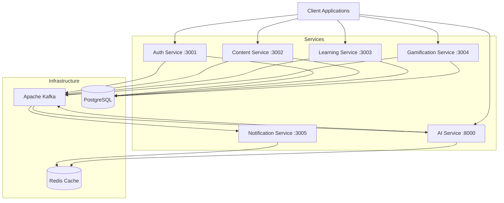
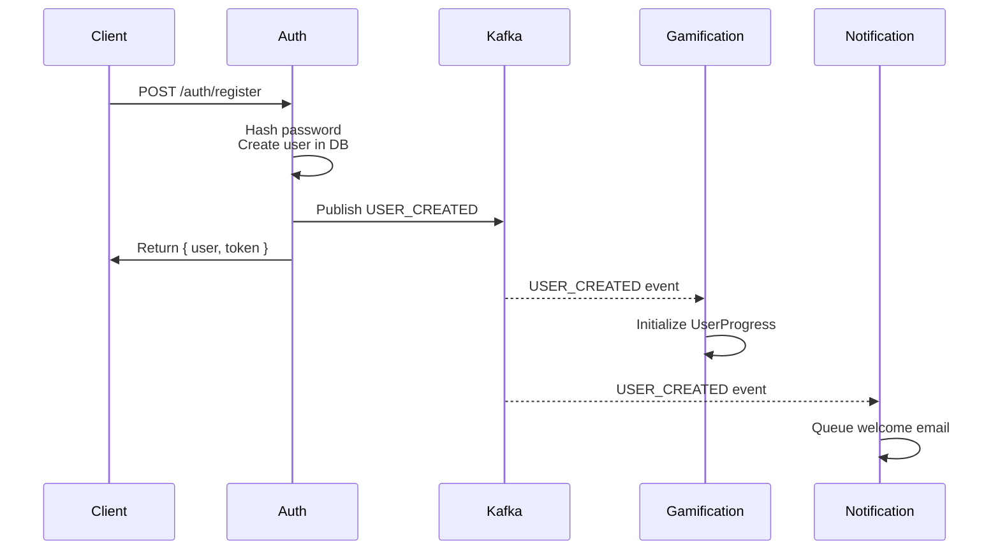
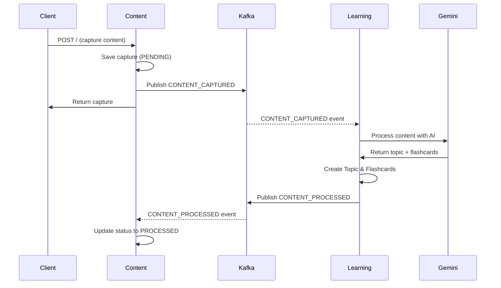
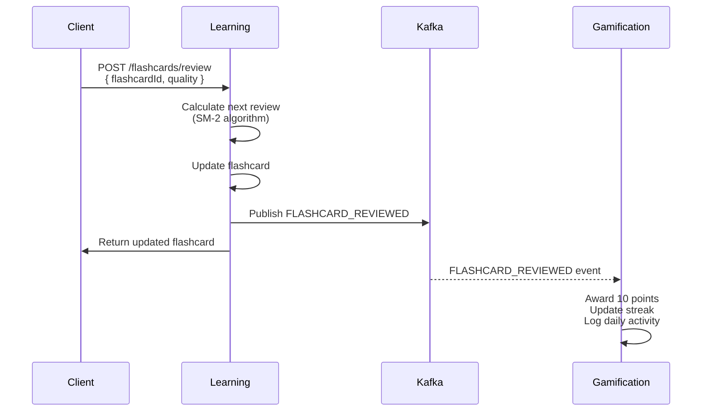
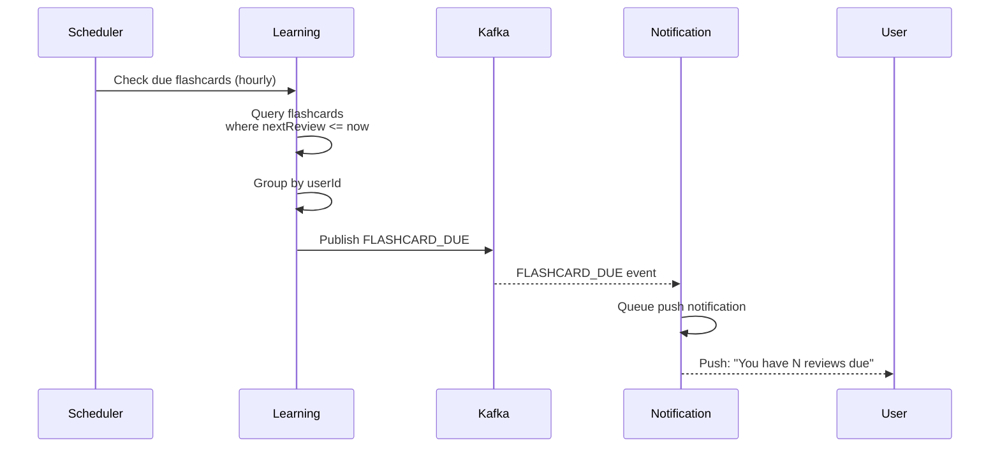

# Kai Backend - Microservices Architecture

> **Event-Driven Learning Platform Backend**  
> A scalable microservices architecture for AI-powered content capture, learning, and gamification.

## 📋 Table of Contents

- [Architecture Overview](#architecture-overview)
- [Infrastructure](#infrastructure)
- [Microservices](#microservices)
- [Data Flow](#data-flow)
- [Getting Started](#getting-started)
- [API Reference](API_README.md)
- [Database Schemas](#database-schemas)
- [Event System](#event-system)
- [Development](#development)
- [Remaining Work](#remaining-work)

---

## 🏗️ Architecture Overview

Kai follows an event-driven microservices architecture with the following key components:



### Design Principles

- **Event-Driven**: Asynchronous communication via Kafka for loose coupling
- **Database Per Service**: Each microservice owns its data (auth_db, content_db, learning_db, gamification_db)
- **Polyglot Architecture**: TypeScript/Bun for core services, Python/FastAPI for AI/ML workloads
- **Technology Stack**: Bun runtime, TypeScript, Express, Prisma ORM, PostgreSQL, Python, PyTorch
- **Scalability**: Horizontal scaling with containerized services
- **Resilience**: Graceful error handling, Kafka retry mechanisms

---

## 🔧 Infrastructure

### Core Components

| Component | Version | Purpose | Port |
|-----------|---------|---------|------|
| **PostgreSQL** | 16-alpine | Primary database with 4 separate DBs | 5432 |
| **Apache Kafka** | 7.3.0 | Event streaming platform | 9092 |
| **Zookeeper** | 7.3.0 | Kafka coordination | 2181 |
| **Redis** | alpine | Caching & queue backend | 6379 |

### Database Configuration

PostgreSQL hosts 4 isolated databases:
- `auth_db` - User authentication data
- `content_db` - Content captures
- `learning_db` - Topics, flashcards, syllabi
- `gamification_db` - User progress, achievements, streaks

### Message Broker Topics

- `user-events` - User lifecycle events (registration, profile updates)
- `content-events` - Content capture and processing events
- `learning-events` - Learning activities (topic completion, flashcard reviews)
- `reminder-events` - Scheduled reminders and notifications

---

## 🎯 Microservices

### 1. Auth Service (Port 3001)

**Purpose**: User authentication and authorization

#### Database Schema (auth_db)

```prisma
model User {
  id                String   @id @default(uuid())
  email             String   @unique
  password          String   // bcrypt hashed
  name              String?
  role              String   @default("USER") // USER, ADMIN
  isVerified        Boolean  @default(false)
  verificationToken String?
  verificationTokenExpiry DateTime?
  resetToken        String?
  resetTokenExpiry  DateTime?
  provider          String?  // google, github, etc.
  providerId        String?
  createdAt         DateTime @default(now())
  updatedAt         DateTime @updatedAt
  deletedAt         DateTime?
  archivedAt        DateTime?
}

model RefreshToken {
  id         String    @id @default(uuid())
  userId     String
  token      String    @unique // Hashed SHA256
  expiresAt  DateTime
  createdAt  DateTime  @default(now())
  isRevoked  Boolean   @default(false)
  revokedAt  DateTime?

  @@index([userId])
  @@index([token])
}

model UserPreferences {
  id                      String   @id @default(uuid())
  userId                  String   @unique
  focusModeDefault        String?  // Default focus mode ID
  theme                   String   @default("LIGHT") // LIGHT, DARK, AUTO
  language                String   @default("en")
  createdAt               DateTime @default(now())
  updatedAt               DateTime @updatedAt
}
```


#### Features Implemented

✅ User registration with bcrypt password hashing
✅ JWT token-based authentication (1h expiry)
✅ User login with credential validation
✅ Kafka event publishing (USER_CREATED, USER_UPDATED, USER_DELETED)
✅ Duplicate email prevention
✅ **User Preferences** (Theme, Language, Focus Mode Default)
✅ **Account Management** (Profile Update, Delete Account, Change Password)
✅ **Security** (Rate Limiting, Helmet, CORS)

✅ **Email Verification**: Full flow with token generation and email delivery.
✅ **Password Reset**: Secure reset flow with email notifications.
✅ **Refresh Token**: Secure token rotation implemented.
✅ **OAuth**: Google and GitHub integration via Passport.js.
✅ **RBAC**: Role-based access control with `requireRole` middleware and admin routes.

#### Features Remaining

(None - All planned auth features implemented)

#### Event Publishing

- **USER_CREATED**: Published when a new user registers
  ```typescript
  {
    type: 'USER_CREATED',
    data: {
      id: string,
      email: string,
      name: string,
      createdAt: Date
    }
  }
  ```

---

### 2. Content Service (Port 3002)

**Purpose**: Content capture and management (screenshots, text, videos)

#### Database Schema (content_db)

```prisma
model Capture {
  id              String   @id @default(uuid())
  userId          String
  type            String   // SCREENSHOT, TEXT, VIDEO
  content         String   // Text content or URL
  source          String?  // App name
  status          String   @default("PENDING") // PENDING, PROCESSED, FAILED
  metadata        String?  // JSON string
  aiProcessed     Boolean  @default(false)
  extractedText   String?
  entities        String?  // JSON
  sentiment       String?
  importanceScore Float?
  ocrStatus       String   @default("PENDING")
  processingError String?
  createdAt       DateTime @default(now())
  updatedAt       DateTime @updatedAt
  deletedAt       DateTime?
  archivedAt      DateTime?
}

model ScreenshotMetadata {
  id              String   @id @default(uuid())
  captureId       String   @unique
  ocrText         String?
  detectedApp     String?
  detectedUrl     String?
  hasText         Boolean  @default(false)
  hasImage        Boolean  @default(false)
  hasCode         Boolean  @default(false)
  dominantColors  String?  // JSON array
  width           Int?
  height          Int?
  fileSize        Int?
  createdAt       DateTime @default(now())
  updatedAt       DateTime @updatedAt
}

model ExtractedContent {
  id          String   @id @default(uuid())
  captureId   String
  contentType String   // LINK, CODE, QUOTE, CONCEPT, TASK
  content     String
  context     String?
  position    Int?
  metadata    String?
  createdAt   DateTime @default(now())
}

model ContentRanking {
  id                String   @id @default(uuid())
  captureId         String   @unique
  userId            String
  relevanceScore    Float    @default(0.5)
  recencyScore      Float    @default(1.0)
  engagementScore   Float    @default(0.0)
  finalScore        Float    @default(0.5)
  isEssential       Boolean  @default(false)
  isPinned          Boolean  @default(false)
  isArchived        Boolean  @default(false)
  lastAccessedAt    DateTime?
  accessCount       Int      @default(0)
  createdAt         DateTime @default(now())
  updatedAt         DateTime @updatedAt

  @@index([userId, finalScore])
  @@index([userId, isEssential])
}

model Tag {
  id        String   @id @default(uuid())
  name      String
  userId    String
  createdAt DateTime @default(now())
  updatedAt DateTime @updatedAt
  captures  Capture[]

  @@unique([userId, name])
  @@index([userId])
}
```


#### Features Implemented

✅ Content capture creation (SCREENSHOT, TEXT, VIDEO)
✅ Content retrieval by userId
✅ **Search Suggestions** (Type-ahead based on content)
✅ Kafka event publishing (CONTENT_CAPTURED)
✅ Status tracking (PENDING, PROCESSED, FAILED)
✅ Consumer for CONTENT_PROCESSED events (updates status)
✅ **Screenshot Processing**
  - **File Upload** (Multer + AWS SDK v3 for R2)
  - **OCR** (Tesseract.js)
  - **AI Analysis** (Gemini)

#### Features Remaining

✅ **Advanced Search**: Full-text search with filters (content, source, tags, date).
✅ **Pagination**: Standardized pagination with metadata.
✅ **Tagging**: Tag management system (add/remove tags).
✅ **Video Transcription**: Async video processing with mock transcription service.

#### Features Remaining

(None - All planned content features implemented)

#### Event System

**Publishing:**
- **CONTENT_CAPTURED**: When new content is captured

**Consuming:**
- **CONTENT_PROCESSED**: Updates capture status from Learning Service

---

### 3. Learning Service (Port 3003)

**Purpose**: AI-powered learning content generation with spaced repetition

#### Database Schema (learning_db)

```prisma
model Topic {
  id        String   @id @default(uuid())
  name      String
  userId    String
  parentId  String?
  createdAt DateTime @default(now())
  updatedAt DateTime @updatedAt
  deletedAt DateTime?
  archivedAt DateTime?
}

model Syllabus {
  id        String   @id @default(uuid())
  topicId   String   @unique
  content   String   // JSON structure
  createdAt DateTime @default(now())
  updatedAt DateTime @updatedAt
}

model Flashcard {
  id         String   @id @default(uuid())
  topicId    String
  front      String
  back       String
  nextReview DateTime
  interval   Int
  easeFactor Float
  difficulty String   @default("NORMAL")
  createdAt  DateTime @default(now())
  updatedAt  DateTime @updatedAt
  deletedAt  DateTime?
  archivedAt DateTime?
}

model ReviewLog {
  id          String   @id @default(uuid())
  userId      String
  flashcardId String
  topicId     String
  quality     Int      // 0-5
  easeFactor  Float
  interval    Int
  reviewedAt  DateTime @default(now())
}

model InterventionRule {
  id              String   @id @default(uuid())
  userId          String
  name            String
  description     String?
  triggerType     String   // TIME_BASED, APP_BASED, BEHAVIOR_BASED
  triggerCondition String  // JSON
  actionType      String   // REDIRECT, NOTIFY, BLOCK, SUGGEST
  actionTarget    String
  priority        Int      @default(0)
  isActive        Boolean  @default(true)
  timesTriggered  Int      @default(0)
  successRate     Float?
  createdAt       DateTime @default(now())
  updatedAt       DateTime @updatedAt
}

model KaizenSession {
  id              String   @id @default(uuid())
  userId          String
  goalId          String?
  sessionType     String   // FOCUS, LEARNING, REFLECTION, REVIEW
  startedAt       DateTime @default(now())
  endedAt         DateTime?
  duration        Int?
  activitiesCount Int      @default(0)
  capturesCount   Int      @default(0)
  flashcardsCount Int      @default(0)
  productivityScore Float?
  notes           String?
  mood            String?
  createdAt       DateTime @default(now())
  updatedAt       DateTime @updatedAt
}

model MemoryInsight {
  id              String   @id @default(uuid())
  userId          String
  title           String
  description     String
  memoryType      String   // MILESTONE, STREAK, LEARNING_BURST
  relatedIds      String   // JSON
  thumbnailUrl    String?
  startDate       DateTime
  endDate         DateTime?
  metrics         String?  // JSON
  sentiment       String   @default("POSITIVE")
  isViewed        Boolean  @default(false)
  viewedAt        DateTime?
  createdAt       DateTime @default(now())
}

model ScreenTimePattern {
  id                String   @id @default(uuid())
  userId            String
  date              DateTime
  appName           String
  totalMinutes      Int      @default(0)
  sessionCount      Int      @default(0)
  longestSession    Int      @default(0)
  isDoomscroll      Boolean  @default(false)
  scrollVelocity    Float?
  interactionRate   Float?
  timeOfDay         String?
  createdAt         DateTime @default(now())
  updatedAt         DateTime @updatedAt
}

model Intervention {
  id              String   @id @default(uuid())
  userId          String
  triggerReason   String
  detectedApp     String
  status          String   @default("PENDING")
  contentType     String?
  contentId       String?
  contentPreview  String?
  triggeredAt     DateTime @default(now())
  respondedAt     DateTime?
  expiresAt       DateTime
  metadata        String?
  createdAt       DateTime @default(now())
  updatedAt       DateTime @updatedAt
}

model EssentialSpaceItem {
  id          String   @id @default(uuid())
  userId      String
  itemType    String
  itemId      String?
  title       String
  description String?
  priority    String
  score       Float
  metadata    String?
  shownAt     DateTime @default(now())
  createdAt   DateTime @default(now())
}

model EssentialSpaceFeedback {
  id          String   @id @default(uuid())
  userId      String
  itemId      String
  itemType    String
  rating      Int
  feedback    String?
  createdAt   DateTime @default(now())
}

model FocusSession {
  id              String   @id @default(uuid())
  userId          String
  duration        Int
  actualDuration  Int?
  topic           String?
  allowedApps     String
  blockedApps     String
  status          String   @default("ACTIVE")
  startedAt       DateTime @default(now())
  endedAt         DateTime?
  interruptions   Int      @default(0)
  pomodoroCount   Int      @default(0)
  createdAt       DateTime @default(now())
}

model FocusInterruption {
  id              String   @id @default(uuid())
  sessionId       String
  appName         String
  timestamp       DateTime @default(now())
  handled         Boolean  @default(false)
  createdAt       DateTime @default(now())
}

model FocusMode {
  id                String   @id @default(uuid())
  userId            String
  name              String
  description       String?
  duration          Int
  blockedApps       String   // JSON array
  allowedApps       String   // JSON array
  isActive          Boolean  @default(false)
  startedAt         DateTime?
  endedAt           DateTime?
  totalSessions     Int      @default(0)
  totalMinutes      Int      @default(0)
  createdAt         DateTime @default(now())
  updatedAt         DateTime @updatedAt
}

model ScreenUsageLog {
  id          String   @id @default(uuid())
  userId      String
  appName     String
  category    String?
  duration    Int      // Seconds
  timestamp   DateTime @default(now())
  metadata    String?
  createdAt   DateTime @default(now())
}

model DoomscrollEvent {
  id                String   @id @default(uuid())
  userId            String
  appName           String
  startedAt         DateTime
  endedAt           DateTime?
  duration          Int?
  scrollDistance    Float?
  itemsViewed       Int?
  interventionId    String?
  wasInterrupted    Boolean  @default(false)
  createdAt         DateTime @default(now())
}

model InterventionSuccess {
  id                String   @id @default(uuid())
  userId            String
  ruleId            String
  triggeredAt       DateTime @default(now())
  wasSuccessful     Boolean  @default(false)
  userAction        String?
  timeToAction      Int?
  contextBefore     String?
  contextAfter      String?
  createdAt         DateTime @default(now())
}
```


#### Features Implemented

✅ Topic creation and management
✅ Flashcard CRUD operations
✅ **Spaced Repetition System (SM-2 Algorithm)**
✅ **AI Content Processing (Gemini LLM)**
✅ **Review Scheduler** (Hourly checks)
✅ **Analytics Dashboard** (Overview, Study Time, Accuracy)
✅ **Focus Tunnel** (Pomodoro, Distraction blocking)
✅ **Focus Mode Management** (CRUD, Active state)
✅ **Essential Space** (Context-aware feed)
✅ **Memory & Insights** (Daily feed, Mark viewed)
✅ **Doomscroll Detection** (Screen usage logging, Intervention triggering)
✅ **Intervention Engine** (Rules, Responses)

#### Features Remaining

❌ **Syllabus Generation**: Logic needs implementation.
❌ **Bulk Import/Export**: No CSV/JSON support.
❌ **Hierarchy**: Topics are flat; no nesting logic.
❌ **Rich Media**: Flashcards support text only.

#### Services & Algorithms

**SpacedRepetition Service** (`/services/spaced-repetition.ts`)
- Implements **SM-2 (SuperMemo 2) algorithm**
- Quality ratings: 0 (blackout) to 5 (perfect recall)
- Intervals: 1 day → 6 days → interval * easeFactor
- Minimum ease factor: 1.3
- Failure (quality < 3): Reset to 1-day interval

**ContentProcessor Service** (`/services/content-processor.ts`)
- Uses Google Gemini Pro model
- Extracts main topic from text
- Generates 3-5 flashcards automatically
- JSON output parsing with markdown cleanup
- Mock generation fallback

**ReviewScheduler** (`/schedulers/review-scheduler.ts`)
- Runs every hour
- Queries flashcards with `nextReview <= now`
- Groups by userId
- Publishes reminder events

#### Event System

**Publishing:**
- **TOPIC_COMPLETED**: When user marks topic as complete
- **FLASHCARD_REVIEWED**: After flashcard review with quality rating
- **CONTENT_PROCESSED**: After generating topic/flashcards from captured content

**Consuming:**
- **CONTENT_CAPTURED**: Triggers AI processing to create topics and flashcards

---

### 4. Gamification Service (Port 3004)

**Purpose**: User progress tracking, streaks, achievements, and leaderboards

#### Database Schema (gamification_db)

```prisma
model User {
  id        String   @id
  email     String   @unique
  name      String?
  createdAt DateTime @default(now())
  updatedAt DateTime @updatedAt
}

model UserProgress {
  id        String   @id @default(uuid())
  userId    String   @unique
  points    Int      @default(0)
  level     Int      @default(1)
  streak    Int      @default(0)
  createdAt DateTime @default(now())
  updatedAt DateTime @updatedAt
}

model DailyActivity {
  id        String   @id @default(uuid())
  userId    String
  date      DateTime @default(now())
  points    Int      @default(0)
  actions   Int      @default(0)
  createdAt DateTime @default(now())
  updatedAt DateTime @updatedAt
}

model Achievement {
  id          String   @id @default(uuid())
  name        String
  description String
  points      Int
  createdAt   DateTime @default(now())
}

model UserAchievement {
  id            String   @id @default(uuid())
  userId        String
  achievementId String
  unlockedAt    DateTime @default(now())
}

model BehaviorMetric {
  id                String   @id @default(uuid())
  userId            String
  date              DateTime @default(now())
  metricType        String
  value             Float
  appName           String?
  context           String?
  createdAt         DateTime @default(now())
}

model Challenge {
  id            String   @id @default(uuid())
  creatorId     String
  title         String
  description   String
  type          String
  target        Int
  startDate     DateTime
  endDate       DateTime
  status        String   @default("ACTIVE")
  isPublic      Boolean  @default(false)
  createdAt     DateTime @default(now())
}

model ChallengeParticipant {
  id            String   @id @default(uuid())
  challengeId   String
  userId        String
  progress      Int      @default(0)
  completed     Boolean  @default(false)
  joinedAt      DateTime @default(now())
  completedAt   DateTime?
}

model SocialShare {
  id            String   @id @default(uuid())
  userId        String
  type          String
  content       String
  imageUrl      String
  shareCount    Int      @default(0)
  createdAt     DateTime @default(now())
}

model UserGoal {
  id              String   @id @default(uuid())
  userId          String
  title           String
  description     String?
  targetValue     Int
  currentValue    Int      @default(0)
  unit            String   // MINUTES, HOURS, SESSIONS, CAPTURES
  category        String   // FOCUS, LEARNING, PRODUCTIVITY, WELLNESS
  deadline        DateTime?
  isCompleted     Boolean  @default(false)
  completedAt     DateTime?
  createdAt       DateTime @default(now())
  updatedAt       DateTime @updatedAt
}

model Friendship {
  id          String   @id @default(uuid())
  userId      String
  friendId    String
  status      String   @default("PENDING")
  createdAt   DateTime @default(now())
  updatedAt   DateTime @updatedAt
}
```


#### Features Implemented

✅ **Rules Engine** (Points, Streaks, Levels)
✅ **Leaderboard** (Global Top 10)
✅ **Social Share** (Stats sharing)
✅ **Achievements** (Unlock logic, My Achievements)
✅ **Challenges** (Create, Join, List, My Challenges)
✅ **Goals** (Create, Update, Progress Tracking)
✅ **Friends** (Request, Accept, Reject, List)
✅ **Metrics Ingestion** (For gamification logic)
✅ Kafka consumers (USER_CREATED, TOPIC_COMPLETED, FLASHCARD_REVIEWED)

#### Features Remaining

❌ **Badges**: Visual assets/system missing.
❌ **Advanced Leaderboards**: Weekly/Monthly filters.
❌ **Streak Freeze**: Item system not implemented.

#### Services

**RulesEngine** (`/services/rules-engine.ts`)
- Points allocation per event type
- Daily activity logging with upsert
- Streak calculation based on consecutive days
- Anti-duplicate streak updates (only on first action)

#### Event System

**Consuming:**
- **USER_CREATED**: Initializes UserProgress (0 points, level 1, 0 streak)
- **TOPIC_COMPLETED**: Awards 50 points, updates streak
- **FLASHCARD_REVIEWED**: Awards 10 points, updates streak

---

### 5. Notification Service (Port 3005)

**Purpose**: Email and push notification delivery using job queues

#### Technology

- **BullMQ**: Redis-backed job queues
- **Redis**: Queue storage and processing
- **Prisma**: PostgreSQL database for preferences and history

#### Database Schema (notification_db)

```prisma
model NotificationPreference {
  id                     String   @id @default(uuid())
  userId                 String   @unique
  kaizenReminders        Boolean  @default(true)
  doomscrollInterventions Boolean @default(true)
  memoryOfDay            Boolean  @default(true)
  friendChallenges       Boolean  @default(true)
  weeklyInsights         Boolean  // Channel preferences
  emailEnabled           Boolean  @default(true)
  pushEnabled            Boolean  @default(true)
  smsEnabled             Boolean  @default(true)
  
  createdAt              DateTime @default(now())
  updatedAt              DateTime @updatedAt
}

model NotificationHistory {
  id            String    @id @default(uuid())
  userId        String
  type          String
  channel       String
  status        String    @default("PENDING")
  templateId    String?
  subject       String?
  body          String?
  metadata      String?
  sentAt        DateTime?
  readAt        DateTime?
  failureReason String?
  createdAt     DateTime  @default(now())
  updatedAt     DateTime  @updatedAt
}

model NotificationTemplate {
  id           String   @id @default(uuid())
  name         String   @unique
  type         String
  channel      String
  subject      String?
  bodyTemplate String
  variables    String
  isActive     Boolean  @default(true)
  version      Int      @default(1)
  createdAt    DateTime @default(now())
  updatedAt    DateTime @updatedAt
}

model NotificationQueue {
  id              String    @id @default(uuid())
  notificationId  String
  retryCount      Int       @default(0)
  maxRetries      Int       @default(5)
  nextRetryAt     DateTime
  lastError       String?
  status          String    @default("PENDING")
  createdAt       DateTime  @default(now())
  updatedAt       DateTime  @updatedAt
}

model DeviceToken {
  id        String   @id @default(uuid())
  userId    String
  token     String   @unique
  platform  String
  isActive  Boolean  @default(true)
  lastUsed  DateTime @default(now())
  createdAt DateTime @default(now())
  updatedAt DateTime @updatedAt
}
```

#### Features Implemented

✅ **Email Worker** (BullMQ queue: `email-queue`)  
  - Welcome email on USER_CREATED  
  - **SendGrid Integration** (API Key + Templates)
  - Rate Limiting (Redis-backed)
  - Retry Mechanism (Exponential backoff)
✅ **Push Worker** (BullMQ queue: `push-queue`)  
  - Flashcard due reminders  
  - Streak warning notifications  
  - **Firebase Integration** (Multicast messaging)
✅ **Device Token Management** (Register, Unregister, Stats)
✅ **Notification Preferences** (Granular toggles, Global Email/Push)
✅ **Email Service** (SendGrid integration, Templates)
✅ **Push Notification Service** (Firebase FCM integration)
✅ **Rate Limiting** (Per user/channel)
✅ **Retry Mechanism** (Exponential backoff)
✅ **Template Engine** (Variable substitution)
✅ **In-App Notifications**: History endpoint for fetching user notifications.
✅ **SMS Support**: SMS service and worker for sending text messages.
✅ **Digest Emails**: Weekly summary logic implemented.
✅ **Scheduling**: API to schedule notifications for future delivery.
✅ **Rich Push**: Support for action buttons and images in push payloads.

#### Features Remaining

(None - All planned notification features implemented)
  

#### Workers

**Email Worker** (`/workers/email-worker.ts`)
- Job data: `{ to, subject, body }`
- Logs: job start, completion, failures

**Push Worker** (`/workers/push-worker.ts`)
- Job data: `{ userId, title, body }`
- Logs: job start, completion, failures

#### Event System

**Consuming:**
- **USER_CREATED**: Queues welcome email
- **FLASHCARD_DUE**: Queues push notification with due count
- **STREAK_WARNING**: Queues push notification with streak count

---

### 6. AI Service (Port 8000)

**Purpose**: Machine learning and AI processing for retention prediction, curriculum generation, and RAG

#### Technology

- **FastAPI**: Python web framework
- **PyTorch**: Neural networks for retention modeling
- **scikit-learn**: ML algorithms
- **Sentence-Transformers**: Embeddings for RAG
- **Redis**: Embedding cache

#### Features Implemented

✅ **Retention Prediction** (PyTorch neural network)
✅ **Forgetting Curve Modeling** (personalized decay rates)
✅ **Curriculum Generation** (Bloom's taxonomy, IRT-based)
✅ **Document Processing** (structure extraction, topic extraction)
✅ **RAG Engine** (vector embeddings, semantic search)
✅ **Content Analysis** (quality assessment, entity extraction)
✅ **Psychological Profiling** (learning style, cognitive load, burnout risk)
✅ **Kafka Consumer** (async event processing)

#### Features Remaining

(None - All planned AI features implemented)

#### Services

**Retention Model** (`/services/retention_model.py`)
- PyTorch neural network
- Input: User history, review quality, intervals
- Output: Retention probability (0-1)
- Training: Supervised learning on review logs

**Curriculum Generator** (`/services/curriculum_generator.py`)
- Bloom's taxonomy integration
- Topic dependency mapping
- Difficulty progression
- Time estimation

**Document Processor** (`/services/document_processor.py`)
- PDF/DOCX/TXT parsing
- Structure extraction
- Flashcard generation
- Question generation

**RAG Engine** (`/services/rag_engine.py`)
- Sentence-Transformers embeddings
- Vector similarity search
- Context retrieval
- Redis caching

#### Event System

**Consuming:**
- **CONTENT_CAPTURED**: Triggers content analysis
- **DOCUMENT_UPLOADED**: Triggers document processing
- **REVIEW_COMPLETED**: Updates retention model

---

## 🔄 Data Flow

### User Registration Flow



### Content Capture → Learning Flow



### Flashcard Review → Gamification Flow



### Review Reminder Flow



---

## 🚀 Getting Started

### Prerequisites

- [Bun](https://bun.sh) >= 1.0
- [Docker](https://www.docker.com/) & Docker Compose
- [Node.js](https://nodejs.org/) >= 18 (optional, for compatibility)

### Environment Setup

1. **Clone the repository**
   ```bash
   git clone <repository-url>
   cd kai
   ```

2. **Copy environment template**
   ```bash
   cp .env.example .env
   ```

3. **Configure Gemini API Key** (for AI content processing)
   ```bash
   # Add to .env
   GEMINI_API_KEY=your-api-key-here
   ```

### Running with Docker Compose

```bash
# Start all services
docker-compose up -d

# View logs
docker-compose logs -f

# Stop all services
docker-compose down

# Stop and remove volumes (data reset)
docker-compose down -v
```

### Local Development

```bash
# Install dependencies
bun install

# Run all migrations
cd services/auth-service && bun run prisma migrate dev
cd services/content-service && bun run prisma migrate dev
cd services/learning-service && bun run prisma migrate dev
cd services/gamification-service && bun run prisma migrate dev

# Start services individually
cd services/auth-service && bun run index.ts
cd services/content-service && bun run index.ts
cd services/learning-service && bun run index.ts
cd services/gamification-service && bun run index.ts
cd services/notification-service && bun run src/index.ts

# Or use the start script (Docker recommended)
./start-dev.sh
```

### Health Checks

- Auth Service: http://localhost:3001
- Content Service: http://localhost:3002
- Learning Service: http://localhost:3003
- Gamification Service: http://localhost:3004
- Notification Service: http://localhost:3005
- AI Service: http://localhost:8000
- PostgreSQL: localhost:5432
- Kafka: localhost:9092
- Redis: localhost:6379

---

## 📚 API Reference

For detailed API documentation, including endpoints, request bodies, and responses, please refer to [API_README.md](API_README.md).

---

## 🗄️ Database Schemas

### Migration Commands

```bash
# Generate Prisma client
bun run prisma generate

# Create migration
bun run prisma migrate dev --name migration-name

# Apply migrations
bun run prisma migrate deploy

# Reset database (⚠️ deletes all data)
bun run prisma migrate reset
```

### Schema Locations

- Auth: `services/auth-service/prisma/schema.prisma`
- Content: `services/content-service/prisma/schema.prisma`
- Learning: `services/learning-service/prisma/schema.prisma`
- Gamification: `services/gamification-service/prisma/schema.prisma`

---

## 📡 Event System

### Event Topics

| Topic | Publishers | Consumers | Events |
|-------|-----------|-----------|---------|
| `user-events` | Auth Service | Gamification, Notification | USER_CREATED, USER_PREFERENCES_UPDATED, GOAL_SET, FOCUS_MODE_ACTIVATED |
| `content-events` | Content Service | Learning Service | CONTENT_CAPTURED, DOOMSCROLL_DETECTED |
| `learning-events` | Learning Service | Content, Gamification | CONTENT_PROCESSED, TOPIC_COMPLETED, FLASHCARD_REVIEWED, FOCUS_SESSION_COMPLETED |
| `reminder-events` | Learning Service | Notification | FLASHCARD_DUE, STREAK_WARNING |
| `gamification-events` | Gamification Service | Notification | CHALLENGE_CREATED, ACHIEVEMENT_UNLOCKED, LEVEL_UP |

### Event Payload Standards

All events follow this structure:
```typescript
{
  type: string,      // Event type (e.g., 'USER_CREATED')
  data: {            // Event-specific data
    ...
    timestamp: Date  // Event timestamp (where applicable)
  }
}
```

---

## 🛠️ Development

### Project Structure

```
kai/
├── docker-compose.yml          # Infrastructure orchestration
├── packages/
│   └── common/                 # Shared utilities (@shared)
│       ├── src/
│       │   ├── logger.ts       # Winston logger
│       │   ├── errors.ts       # Custom error classes
│       │   ├── queue.ts        # BullMQ queue factory
│       │   └── middleware.ts   # Express middleware
│       └── package.json
├── services/
│   ├── auth-service/
│   │   ├── prisma/schema.prisma
│   │   ├── src/
│   │   │   ├── app.ts
│   │   │   ├── index.ts
│   │   │   ├── controllers/auth.controller.ts
│   │   │   ├── routes/auth.routes.ts
│   │   │   ├── kafka.ts
│   │   │   └── prisma.ts
│   │   └── Dockerfile
│   ├── content-service/
│   │   ├── src/
│   │   │   ├── consumers/learning-consumer.ts
│   │   │   └── ...
│   ├── learning-service/
│   │   ├── src/
│   │   │   ├── services/
│   │   │   │   ├── spaced-repetition.ts
│   │   │   │   └── content-processor.ts
│   │   │   ├── schedulers/review-scheduler.ts
│   │   │   ├── consumers/content-consumer.ts
│   │   │   └── ...
│   ├── gamification-service/
│   │   ├── src/
│   │   │   ├── services/rules-engine.ts
│   │   │   ├── consumers/
│   │   │   │   ├── user-consumer.ts
│   │   │   │   └── learning-consumer.ts
│   │   │   └── ...
│   └── notification-service/
│       ├── src/
│       │   ├── consumers/
│       │   │   ├── user-created.ts
│       │   │   └── reminder-consumer.ts
│       │   ├── workers/
│       │   │   ├── email-worker.ts
│       │   │   └── push-worker.ts
│       │   └── index.ts
└── scripts/
    └── create-multiple-postgresql-databases.sh
```

### Shared Package (@shared)

Located in `packages/common`, provides:
- **Logger**: Winston-based structured logging
- **Error Classes**: BadRequestError, UnauthorizedError, NotFoundError
- **Queue Factory**: BullMQ queue and worker creation
- **Middleware**: asyncHandler, errorHandler, successResponse

### Code Style

- **TypeScript**: Strict mode enabled
- **Linting**: `bun run lint` (runs `tsc --noEmit` for all services)
- **Runtime**: Bun for performance, Node.js compatible

### Testing

> ⚠️ **No tests currently implemented**

Planned testing stack:
- Unit: Jest or Vitest
- Integration: Supertest for API tests
- E2E: Playwright or Cypress

---

## ⚠️ Remaining Work

### Critical Missing Features

#### Security & Authentication
- [x] JWT validation middleware on protected routes
- [x] Refresh token mechanism
- [x] Rate limiting
- [x] CORS configuration review
- [x] Environment variable validation
- [ ] Secrets management (Vault, AWS Secrets Manager)

#### Data & Storage
- [x] File upload handling (CloudFlare R2)
- [ ] Database connection pooling optimization
- [ ] Database indexes for performance
- [ ] Soft delete implementation
- [ ] Data retention policies

#### Monitoring & Observability
- [x] Health check endpoints for all services
- [x] Prometheus metrics
- [ ] Distributed tracing (Jaeger, Zipkin)
- [x] Error tracking (Sentry)
- [x] Log aggregation (Winston structured logs)

#### DevOps & CI/CD
- [ ] Unit tests
- [ ] Integration tests
- [ ] E2E tests
- [ ] CI/CD pipeline (GitHub Actions)
- [ ] Kubernetes manifests
- [ ] Terraform infrastructure as code
- [ ] Staging environment

#### API & Documentation
- [ ] OpenAPI/Swagger documentation
- [ ] API versioning strategy
- [ ] GraphQL federation (optional)
- [x] WebSocket support for real-time updates
- [x] API rate limiting
- [x] Request/response validation (Zod)

#### Feature Completions
- [x] Email verification flow
- [x] Password reset
- [x] OAuth providers
- [x] Syllabus feature (schema exists, basic logic)
- [x] Achievement system (models exist, unlock logic implemented)
- [x] Level-up system (level field exists, progression implemented)
- [x] Notification Service
    - [x] Email notifications (SendGrid)
    - [x] Push notifications (Firebase)
    - [x] SMS notifications
    - [x] In-app notifications
    - [x] Scheduled notifications
- [ ] Hierarchical topic display
- [ ] Flashcard import/export

### Nice-to-Have Features

- [ ] Admin dashboard
- [x] Analytics dashboard
- [ ] Multi-language support (i18n)
- [ ] Dark mode API responses (metadata)
- [ ] Public API with API keys
- [ ] Developer documentation portal
- [ ] Mobile SDK

---

## 📞 Support & Contributing

### Getting Help

- Check service logs: `docker-compose logs -f <service-name>`
- Review Kafka messages: Use Kafka UI or CLI tools
- Database inspection: Use Prisma Studio (`bun run prisma studio`)

### Contributing Guidelines

1. Create feature branch: `git checkout -b feature/your-feature`
2. Make changes and commit: `git commit -am 'Add feature'`
3. Push to branch: `git push origin feature/your-feature`
4. Create pull request

### Code Review Checklist

- [ ] TypeScript compilation passes (`bun run lint`)
- [ ] No hardcoded secrets or API keys
- [ ] Error handling implemented
- [ ] Logging added for debugging
- [ ] Database migrations created if schema changed
- [ ] Kafka events documented if new topics/events
- [ ] README updated if architecture changed

---

## 📄 License

[Add your license here]

---

**Last Updated**: December 2025  
**Built with**: Bun, TypeScript, Express, Prisma, PostgreSQL, Kafka, Redis  
**Architecture**: Event-Driven Microservices
